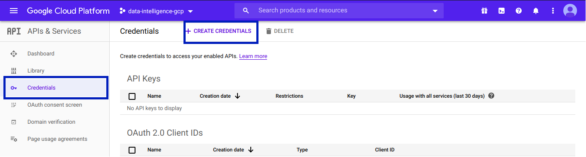

# kubeflow-on-gcp
Deploy Kubeflow on GCP Free Account 

### Setup your Google Cloud Account

#### Step 1: Loging to google cloud for authorization
```bash
gcloud auth login

# create application default credentials
gcloud auth application-default login 
```
#### Step 2: Set the working gcp project and zone as default
```bash
# Set as environement variables as well, we will need this in the next steps

export PROJECT=<YOUR_PROJECT_ID>
export ZONE=<SET_YOUR_ZONE>

gcloud config set project ${PROJECT}
gcloud config set compute/zone ${ZONE}
```
### Prepare Kubeflow
#### Step 3: Download and extract kubeflow release based on your OS 
You can find the latest release here https://github.com/kubeflow/kfctl/releases

```bash
# Set the link as env variable as well as the file name

export KFCTL_FILE_PATH=https://github.com/kubeflow/kfctl/releases/download/v1.0.1/kfctl_v1.0.1-0-gf3edb9b_linux.tar.gz
export KFCTL_FILE="kfctl.tar.gz"

# Download kfctl
wget $KFCTL_FILE_PATH -O $KFCTL_FILE

# Extract the content while downlad finished
tar -xvf ${KFCTL_FILE}
```
#### Step 4: Add KFCTL to env PATH
```bash
PATH=${PATH}:$(pwd)
```
### Setup Deployment
#### Step 5: Get Client ID and Client Secret from Google Cloud 


- Create an ```Create OAuth client ID```
- Choose Application type as ```Web Application```
- Rename an application name wathever you want
- Add URI by following the pattern: 

```bash 
https://iap.googleapis.com/v1/oauth/clientIds/<CLIENT_ID>:handleRedirect 
```
  
  RQ: To get ```CLIENT_ID``` first create the OAuth Client without URI and then edit it to add URI
 
 #### Step 6: Set client_id and client secret from GCP credentials 
```bash 
export KF_NAME=<YOUR_DEPLOYMENT_NAME> 
export CLIENT_ID=<CLIENT_ID>
export CLIENT_SECRET=<CLIENT_SECRET>
```
#### Step 7: Get the latest config URI from official documentation
See here https://www.kubeflow.org/docs/gke/deploy/deploy-cli/
And set is as an environement variable
```bash
export CONFIG_URI="https://raw.githubusercontent.com/kubeflow/manifests/v1.0-branch/kfdef/kfctl_gcp_iap.v1.0.2.yaml"
```
#### Step 8: Configure directories
```bash
# set base directory where your kfctl is extracted
BASE_DIR=$(pwd)
# set the directory for deployment 
KF_DIR=${BASE_DIR}/${KF_NAME}
# create the directory 
mkdri ${KF_DIR}
# navigate to the folder 
cd ${KF_DIR}
```
#### Step 9: Build the deployment using the config file
```bash
kfctl build -V -f ${CONFIG_URI}
```

### Config Kubeflow-Cluster
#### Step 10: Desable accelerator
Inside your ```$KF_DIR``` navigate to the ```gcp_config``` folder and then edit the ```cluster-kubeflow.yaml``` as follow:
- Set the max accelerator coutn to 0
```bash
- name: kubeflow
  properties:
    autoprovisioning-config:
      enabled: false
      max-accelerator:
      - count: 0
        type: nvidia-tesla-k80
      max-cpu: 6
      max-memory: 30
```
- Change the  ```cpu-pul-machine-type``` to ``` n1-standard-2 ```.

You can choose any type of machine but it have to be under you quotas limit.
```
cpu-pool-enable-autoscaling: true
cpu-pool-initialNodeCount: 2
cpu-pool-machine-type: n1-standard-2
cpu-pool-max-nodes: 6
cpu-pool-min-nodes: 0
```
- Set the gpu-pool-max and min nodes to 0
```
gpu-pool-initialNodeCount: 0
gpu-pool-machine-type: n1-standard-2
gpu-pool-max-nodes: 0
gpu-pool-min-nodes: 0
```
### Deploy 
#### Step 11: Setup the config file and deploy
```bash
# set the config file
export CONFIG_FILE=${KF_DIR}/kfctl_gcp_iap_v1.x.x.yaml
# apply change and deploy 
kfctl apply -V --file=${CONFIG_FILE}
```
### Enjoy kubeflow!!
